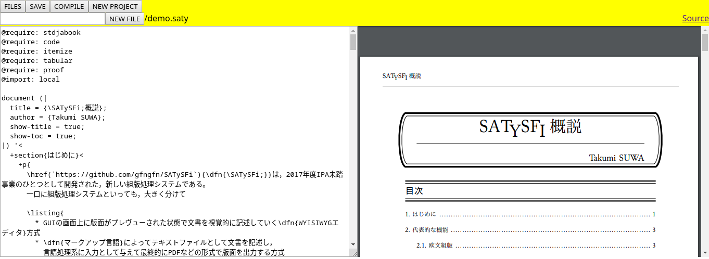

# SATySFi-Online
(Work in Progress)

[SATySFi](https://github.com/gfngfn/SATySFi)がOnlineで使えたら→→うれしい！！

## Screenshot



## Requirements

- go 1.13
- Elm 0.19.1
- Docker >= 19.03

## DevDependencies

- GNU Make
- yarn
- [cespare/reflex](https://github.com/cespare/reflex)
- [statik](https://github.com/rakyll/statik)

## How to use

(with reflex)

1. make dev
2. access `http://loacalhost:8888`

(without reflex)
1. make setup
2. make build
3. PORT=8888 make run
4. access `http://loacalhost:8888`

**NOTE**: This tool uses a Docker image for PDF generation. When starting the application local environment, execute the following command before compiling the SATySFi document.

```
$ docker pull theoldmoon0602/satysfi:latest
```

## Directory Structure

```
.
├── config.json             # 設定ファイル。いる
├── docs
│   └── screenshot.png
├── go.mod
├── go.sum
├── LICENSE
├── main.go                 # 本体。ファイルの配信とかコンパイルとかやる
├── Makefile
├── README.md
├── reflex.conf
├── template                # プロジェクトのデフォルトの構成。名前はconfig.jsonに依る
│   ├── assets
│   ├── demo.saty
│   └── local.satyh
├── ui                      # フロント。Elm
│   ├── elm.json
│   ├── elm-stuff
│   ├── index.html
│   ├── index.js
│   ├── main.css
│   ├── package.json
│   ├── src
│   └── yarn.lock
└── work                    # Project保管ばしょ。config.jsonに書いてある

```

## Want to DO

- [ ] 実ディレクトリをいじる代わりにDBをいじるようにしたい（なんかアプリケーションを分散させられる気がするので）
- [ ] エディタをまともにしたい（シンタックスハイライト・補完……）
- [ ] いい感じビルド＆デプロイ機構がほしい

## Author

theoremoon

## License

Apache 2.0 (SATySFiはLGPLだけど大丈夫かな……？)
